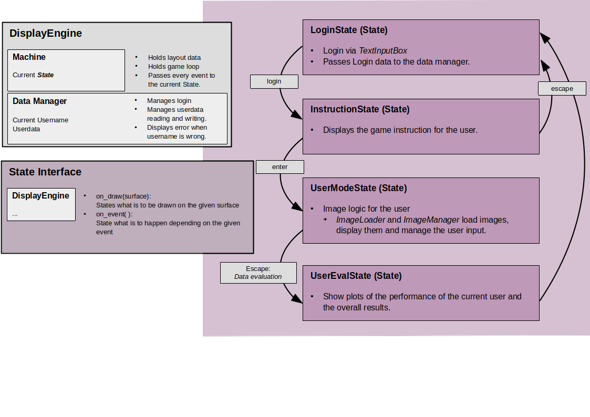

# Can 3DMM seperate identity and expression data?


An Sabrina: den Teil ignorieren :D
Description, detail mode, game mode definition

The main features:

* **Reconstruction:** produces head pose, shape, detailed face geometry, and lighting information from a single image.
* **Animation:** animate the face with realistic wrinkle deformations.
* **Robustness:** tested on facial images in unconstrained conditions.  Our method is robust to various poses, illuminations and occlusions. 
* **Accurate:** state-of-the-art 3D face shape reconstruction on the [NoW Challenge](https://ringnet.is.tue.mpg.de/challenge) benchmark dataset.

## Hier gehts los.
  
## Getting Started
Clone the repo:
  ```bash
  git clone https://github.com/fenjaWagner/Anwendungspraktikum-SS24.git
  cd src
  ```  

### Requirements
These are the packages and versions used in the programming process. The game might run with older ones. 
* Python 3.12
* pygame 2.6
* numpy 1.26.4
* matplotlib 3.9.1

  
### Usage
To run the game use
```bash
python3 run.py
```
### Login
Each user logs in via its own unique login name (or number). 

### Result Collection
The results of each user are displayed in three different ways in the folder [result_data](result_data):
1. The data dictionary that is used while the programm is running is printed in readable style in [readable_data.txt](result_data/readable_data.txt).
2. The results are printed into a the csv file [data.csv](result_data/data.csv).
3. For each user and for the overall result a plot is saved in [plots](result_data/plots) that shows the results in each detail mode.

### Config Settings
All necessary setting changes can be implemented through conf in [configs](src/conf.py).
Conf:
* **detail_modes:** List of implemented details that are applied to the processed images via DECA.
* **order:** The order states whether the user is given a processed image and has to choose from unprocessed pictures ("exp_proc") or vice versa ("exp_unproc").
* **game_modes:** List of the implemented combinations of images of people with certain characteristics that are shown to the user to choose from. 
* **layout:** Layout settings for the game screen

## Add custom detail modes, game modes or new images
All detail modes, game modes that are not allready available in this implementation can be added via the image_conf in the [config file](src/conf.py). New images can be added by respecting the file structure and adding them to the dictionary in the [image_item file](src/image_item.txt).
* **Image format:** At the moment, the programm can only deal with images stored as *.jpg*.
* **Naming convention:** The processed images should be named exactly like the unprocessed images they are based on. Their name should be unique.

* **Add a custom game mode:** Each game mode combines two sets of idenities: First, the *"exp_list"*, that contains the identifier of the persons that can be used for the reference image. Secondly, the *"com_pic_list"*, that contains the identities that can be used as compare images. To add a game mode, add these two lists into the [image item dict](src/image_item.txt). Then add the name of the game mode to *image_conf["game_modes"]* in the [config file](src/conf.py) as in this example:
```
Game mode name: "cats_between_mice"
exp_list: cats = ["mimi", "tom", "crookshanks"]
com_pic_list: mice = ["pieps", "jerry", "scabbers"]

Add to image_item["game_modes"]:
{"cats_between_mice" : {"exp_list" : "cats",
                        "comp_pic_list" : "mice"}}

Add to image_item dict:
"cats" : ["mimi", "tom", "crookshanks"]
"mice" : ["pieps", "jerry", "scabbers"]
```

* **Identity management:** Each person that appears in the pictures has to have its own identity identifier. At the moment, numbers between 1 and 2240 are used. The dictionary in the [image item file](src/image_item.txt) contains a subdictionary called *"identity_pic"*. In here, the names of the images of the person with identity identifier x are stored in a list. At the moment the programm only uses the first two images in this list (that is two pictures per identity).
The [Image Loader](src/Image_Management/image_logic.py) uses this dict to find the right images for the current game mode by using the image names in the lists.
```
"cats" : ["mimi", "tom", "crookshanks"]
"mice" : ["pieps", "jerry", "scabbers"]

image_item dict: {"cats" : ["mimi", "tom", "crookshanks"],
                  "mice" : ["pieps", "jerry", "scabbers"],
                  "identity_pic": {"mimi": ["mimi_pic_1", "mimi_pic_2"],
                                   "tom": ["tom_pic_1", "tom_pic_2"],
                                    ...}
                } 

```
* **Add new images:** To add new images of a new person, add the identity identifier into the lists of the game modes the person should appear in. Then add the following to the identity_pic dict in the [image item dict](src/image_item.txt):
```
<identity code>  : [<image_1_name>, <image_2_name>]
```

* **Add a custom detail mode:** 
    1. Add a folder that is named exactly like the name of the detail mode into *src/file_system/processed* that contains the images with the respective details. 
    2. Add the path to that folder twice into the image_config in [conf.py](src/conf.py) under "exp_proc" and "exp_unproc" so the [Image Loader](src/Image_Management/image_logic.py) can find the right images depending on the order set in the config above.


## Workflow of the program
The programm uses a so called display engine that holds the game loop. This engine manages what is to be shown on the screen via different states. These states also implement what happens when the user does certain actions.

<p align="center"> 

</p>
<p align="center">Overview of the modules and the workflow<p align="center">


## Related works:  
* for better emotion prediction: [EMOCA](https://github.com/radekd91/emoca)  
* for better skin estimation: [TRUST](https://github.com/HavenFeng/TRUST)


## Acknowledgements 
- [DECA](add link) 